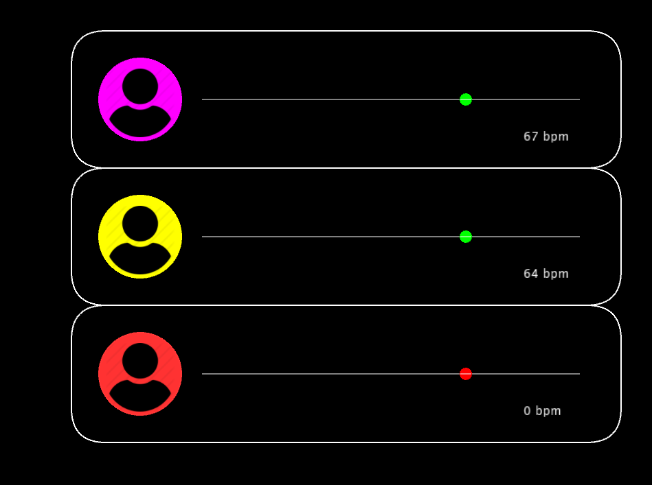
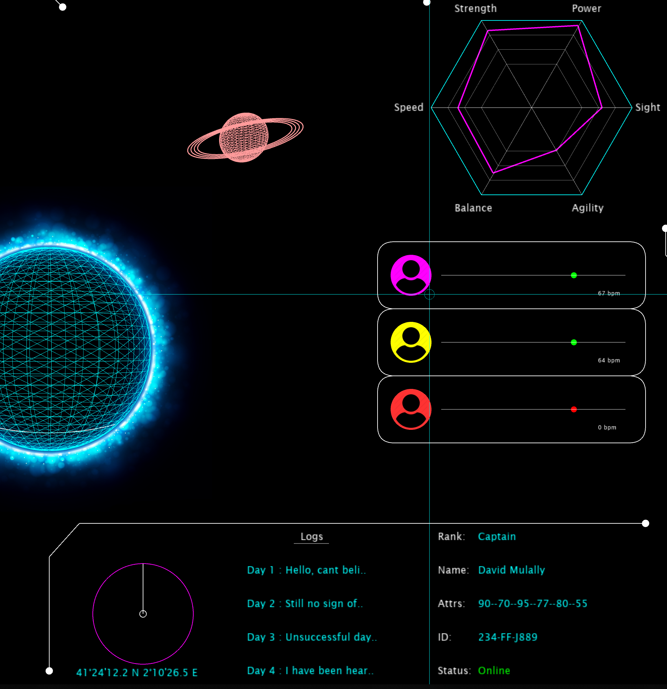

# SciFi UI Project

Name: Andrew McGowan

Student Number: C16470866

# Description of the assignment

My User Interface is a Sci-Fi control panel. My idea came from Prometheus, when they go down to a desolate planet and 3 people stay up in the ship monitoring them. 
Mine is slightely different as it is 3 people, on different parts of the planet. 

# Instructions
To UI is very simple to use. Simply hover over the 3 idividuals for their information. To make contact with them simply hold down the 'space bar' after clicking on their icons. The icon will change when you click on their icon. 
The buttons on the top are to either communicate with 1 person or 3 people. The second last icon is to show you the location of each individual on the planet. The settings button resets everything.

# How it works

# What I am most proud of in the assignment

# Markdown Tutorial

This is *emphasis*

## CSV File
- The CSV file I used is Attributes.csv, whish contained the level of strengh etc. of the soldiers.
- The class Attributes.java is where get the details and get their values as local variables.
- In UI.java I load the table into an aray list called "attributes". I load and print the details in the same function ( void loadTable() ).

## Interactive ( Buttons )
- There are 8 buttons in my UI

- Person Icon = Communicate with one person
- People Icon = Communicate with all three people
- Location Icon = Show where they are on the planet 
- SEttings Icon - Reset Buttons

- When you click one of these 3 frames you begin to communicate with that one person

I used a global variable 'int COLOR_W' which was then used in an if statement to make the given changes. 

## Interactive ( Floating )

- When tou float over the frames on the right / midde you will get the attributes and details of each solider.

## PVectors

## Transforms

## Polymorphism

## Abstract Classes

## Interfaces
This is a numbered list

1. Item
1. Item

This is a [hyperlink](http://bryanduggan.org)

# Headings
## Headings
#### Headings
##### Headings

This is code:

```Java
public void render()
{
	ui.noFill();
	ui.stroke(255);
	ui.rect(x, y, width, height);
	ui.textAlign(PApplet.CENTER, PApplet.CENTER);
	ui.text(text, x + width * 0.5f, y + height * 0.5f);
}
```

So is this without specifying the language:

```
public void render()
{
	ui.noFill();
	ui.stroke(255);
	ui.rect(x, y, width, height);
	ui.textAlign(PApplet.CENTER, PApplet.CENTER);
	ui.text(text, x + width * 0.5f, y + height * 0.5f);
}
```

This is an image using a relative URL:


This is an image using an absolute URL:


This is a youtube video:

[](https://www.youtube.com/watch?v=J2kHSSFA4NU)

This is a table:

| Heading 1 | Heading 2 |
|-----------|-----------|
|Some stuff | Some more stuff in this column |
|Some stuff | Some more stuff in this column |
|Some stuff | Some more stuff in this column |
|Some stuff | Some more stuff in this column |

